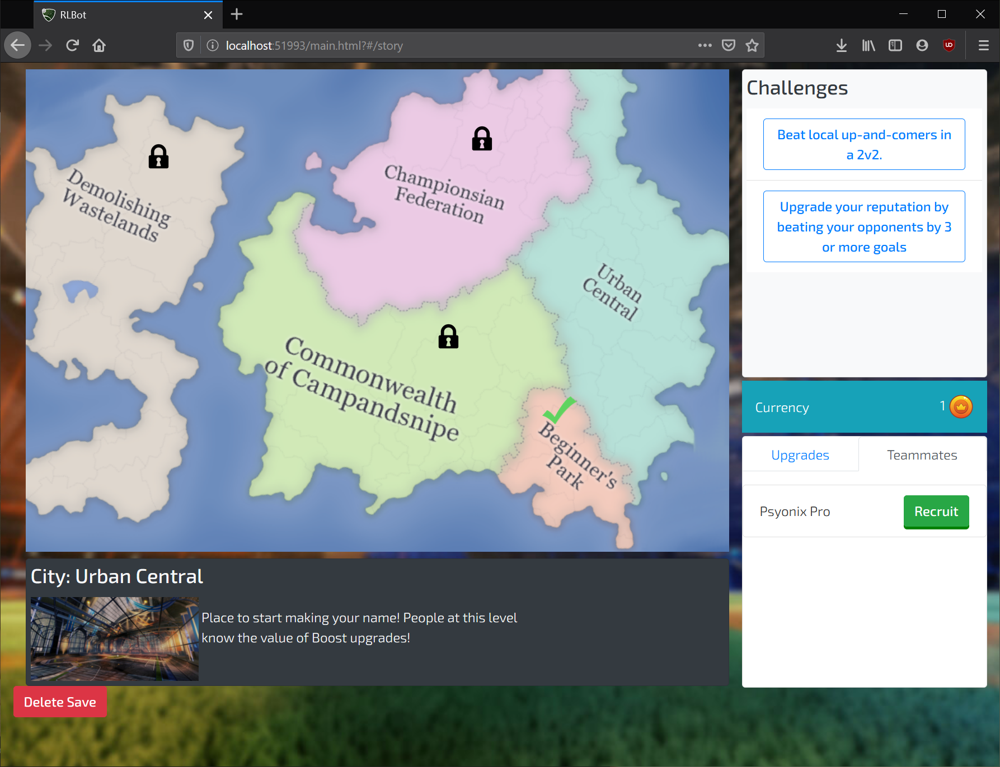
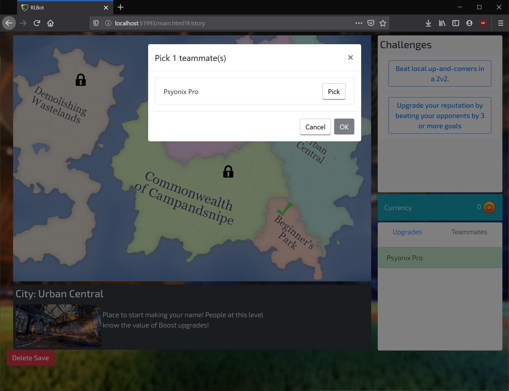
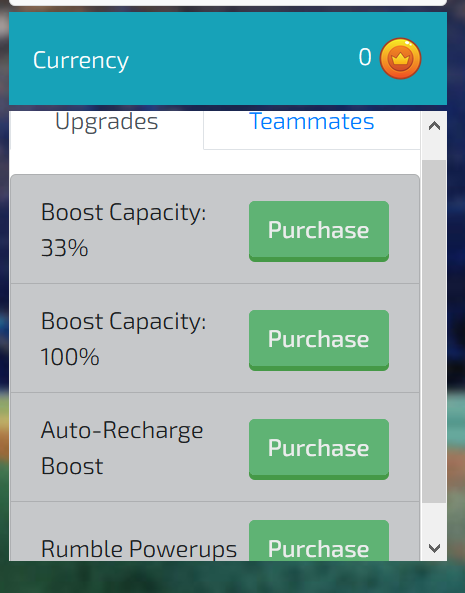

# Rocket League Story Mode

## Story Mode support has been merged back into RLBotGUI
## New updates are only added in RLBotGUI

This project used RLBot and RLBotGui to provide a Story Mode for
Rocket League. The story UI runs in your browser and it can
start games to continue with the story.

Here are some images from the UI.

The map area shows the various cities. You can select challenges on the
right which lead to this popup:

Here you can pick your teammates and once you click ok, a match is launched.

If you win games, you can use it to purchase upgrades or recruit
teammates

